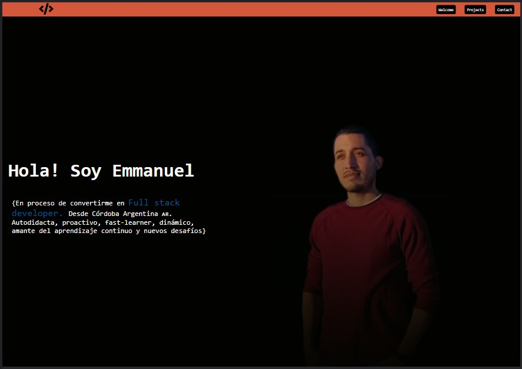
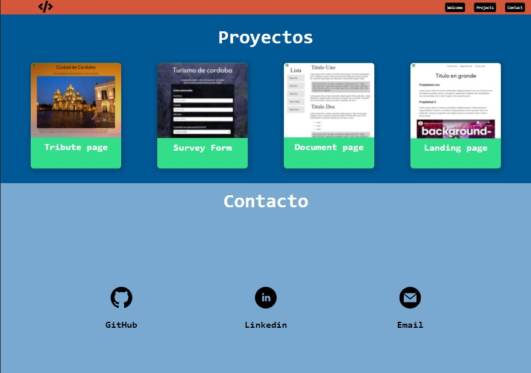

<h1>Portfolio</h1>

Portada de portfolio creado para Freecodecamp y reoptimizado. 
<a href="https://josemat.github.io/" target="_blank">Ir a Josemat
</a>

Sección de proyectos <em>( Ya voy a subir los que vaya realizando de JavaScript) </em> y contacto

