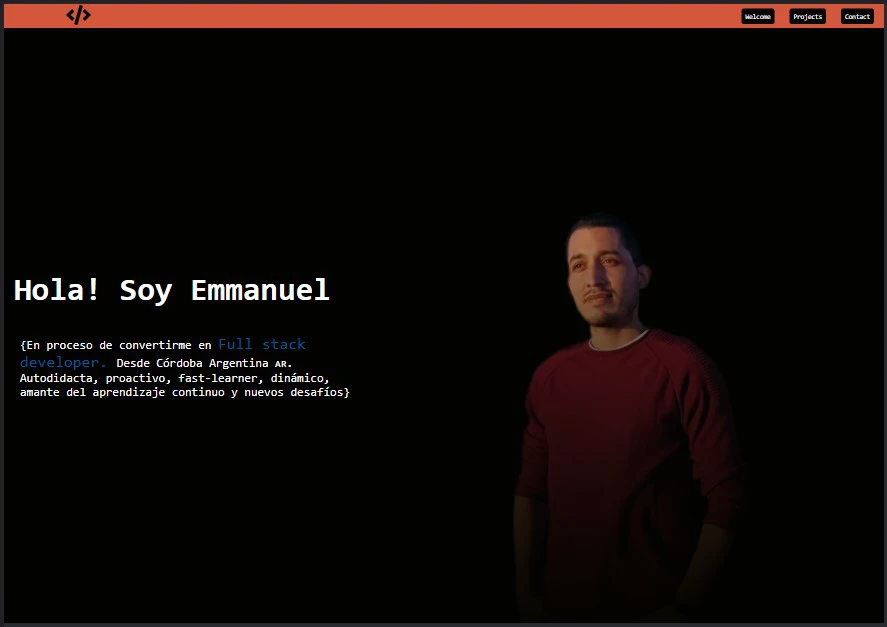
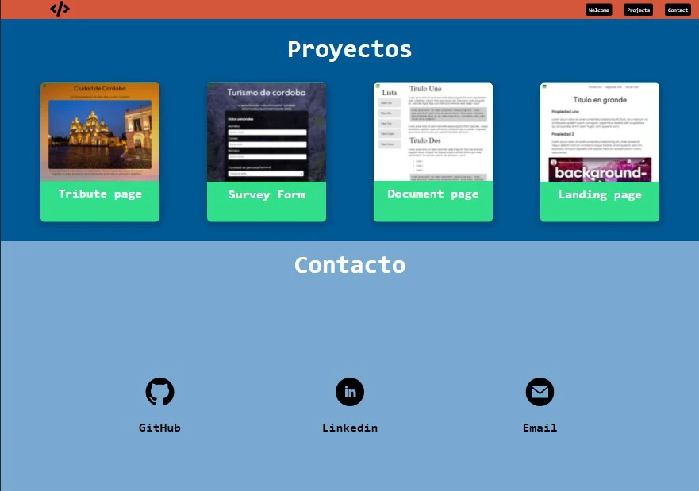

<h1>Portfolio</h1>

Portada de portfolio creado de cero, con elementos y proyectos que voy aprendiendo a medida que me sigo adentrando en este mundo.
 
  <a href="https://josemat.github.io/" target="_blank">Ir a Josemat</a> 

Sección de proyectos y contacto <em>( Ya hay subidos varios ejercicios de JavaScript) </em>

